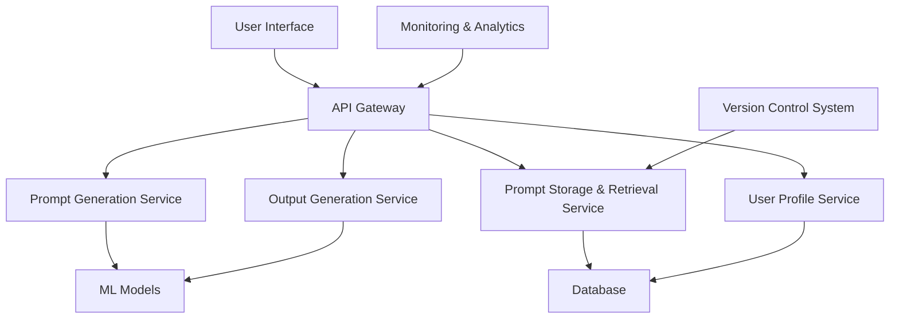

# Ahyea! Promptorama!

**Ahyea! Promptorama!** is an AI-powered platform that helps users generate creative and meaningful prompts using natural language processing (NLP) models. The system supports versioning, collaboration, and multi-modal output generation using state-of-the-art AI models such as GPT-3. It also includes a comprehensive monitoring, storage, and retrieval service for managing and optimizing user interactions and prompt generations.

## Table of Contents

- [Overview](#overview)
- [System Architecture](#system-architecture)
- [Features](#features)
- [Tech Stack](#tech-stack)
- [Installation Instructions](Installation-Instructions.md)
- [Usage Information](Usage-Info.md)
- [API Endpoints](#api-endpoints)
- [Development and Testing](Development--and-Testing.md)
- [Contributing](#contributing)
- [License](#license)

## Overview

**Ahyea! Promptorama!** is designed to assist users in generating customized prompts tailored to their individual needs. With features such as user profiling, prompt versioning, and explainable AI, this platform enables both individual users and teams to collaborate and optimize prompt generation through machine learning models and human feedback loops.

The platform consists of the following components:
- **Prompt Generation Service**: Utilizes NLP models to generate relevant and creative prompts based on user input.
- **Prompt Storage & Retrieval Service**: Allows users to store and retrieve prompts efficiently, with search capabilities powered by Elasticsearch.
- **User Profile Service**: Personalizes the experience for users based on their preferences and history.
- **Output Generation Service**: Supports multi-modal outputs like text, images, or other forms of content, utilizing models like GPT-3 and DALL-E.
- **Explainable AI**: Provides transparency into how AI decisions are made.

## System Architecture

## Features

| Feature                   | Description                                                              |
|---------------------------|--------------------------------------------------------------------------|
| AI-Driven Prompt Generation| Automatically generate high-quality, context-aware prompts using advanced NLP models. |
| Prompt Storage & Retrieval | Save, retrieve, and search for prompts using a flexible database.       |
| Personalized User Profiles | Tailor the prompt generation process based on user preferences and interaction history. |
| Explainable AI            | Understand how the AI-generated content is formed using explainability tools. |
| Version Control & Collaboration | Collaborate on prompt generation with versioning and Git-like branching/merging functionality. |
| Ethical AI & Bias Mitigation | Implement bias checks and ensure responsible use of AI tools.        |

## Tech Stack

- **Backend**: Node.js, Express.js, Python (for AI models)
- **Frontend**: React.js or Next.js
- **Database**: MongoDB, Elasticsearch (for search)
- **AI Models**: GPT-3, DALL-E (via OpenAI API), Custom ML Models
- **Containerization**: Docker, Kubernetes (for orchestration)
- **Monitoring & Analytics**: ELK Stack (Elasticsearch, Logstash, Kibana), Prometheus, Grafana
- **Authentication**: OAuth2 / JWT for secure user authentication

## Installation Instructions

For detailed installation steps, please refer to [Installation Instructions](Installation-Instructions.md).

## Usage Information

For comprehensive usage details, including how to generate prompts and manage user profiles, see [Usage Information](Usage-Info.md).

## API Endpoints

### Core Services

- **POST /api/prompts/generate**
  - Input: User query
  - Output: Generated prompt based on AI model (GPT-3)
  
- **GET /api/prompts/search**
  - Input: Search query
  - Output: List of relevant prompts from the database

- **POST /api/user/profile**
  - Input: User data (preferences, settings)
  - Output: Updated user profile

### Authentication

- **POST /api/auth/login**
  - Input: User credentials
  - Output: JWT Token

- **POST /api/auth/register**
  - Input: User data (email, password)
  - Output: Registered user details

## Development and Testing

For guidance on development practices, testing strategies, and contribution details, check [Development and Testing](Development--and-Testing.md).

## Contributing

We welcome contributions! Follow these steps to contribute:
1. Fork the repository.
2. Create a new branch (`git checkout -b feature/your-feature`).
3. Commit your changes (`git commit -m "Added new feature"`).
4. Push to the branch (`git push origin feature/your-feature`).
5. Open a pull request.

## License

This project is licensed under the MIT License. See the [LICENSE](LICENSE) file for details.

By following this guide, you’ll be able to set up and run the **Ahyea.com Promptorama!** system locally or in the cloud, enabling you to explore AI-powered prompt generation and the various other features.

---
title: "Ahyea! Promptorama!"
description: "An AI-powered platform for generating creative prompts."
author: "Nickolas Susco II"
date: "2024-09-21"
---
